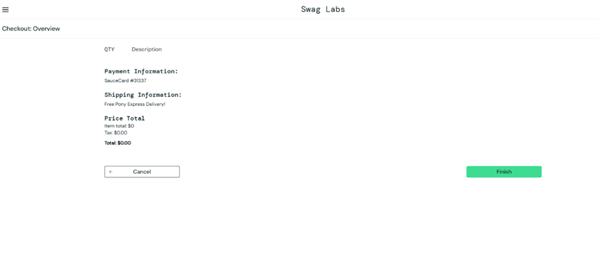
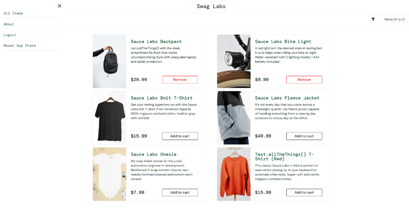
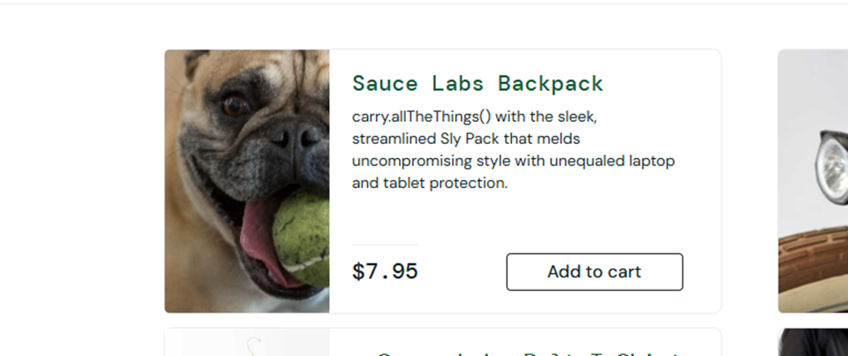
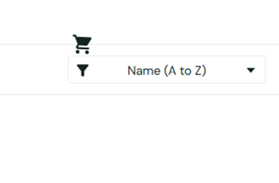
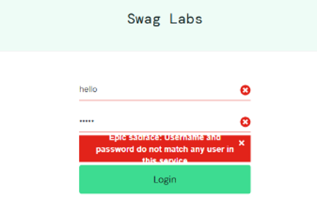
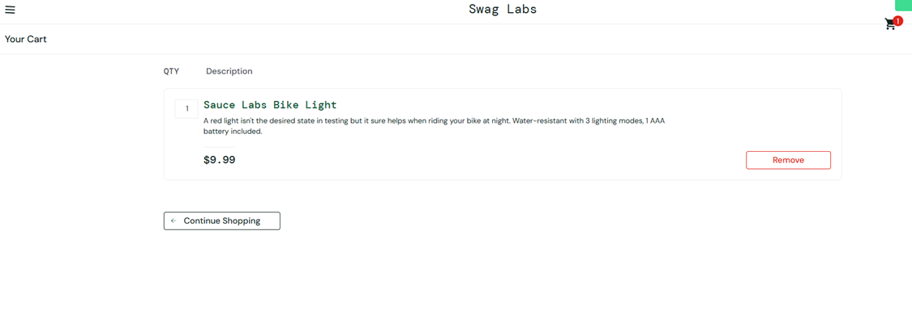
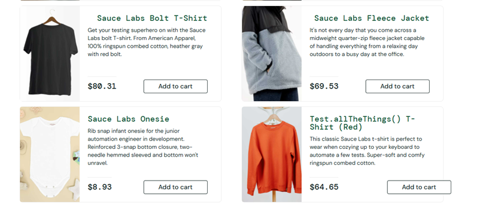

# Sauce Demo Bug Report  

## 001: Empty Cart Allows Checkout  
**Date Found:** February 12, 2025  
**Tested On:** Google Chrome, Windows 11  
**Severity:** High  
**Priority:** P1 (High)  
**Status:** Open  

### Steps to Reproduce  
1. Open SauceDemo website - [SauceDemo](https://www.saucedemo.com)  
2. Login with valid credentials  
3. Navigate to the Cart Page  
4. Ensure cart is empty  
5. Click Checkout  

### Expected Result  
The system should display an error message:  
**“Your cart is empty. Please add items before proceeding.”**  

### Actual Result  
- The system allows users to proceed to checkout, even with an empty cart.  

### Attachments  
**Screenshot:**   

---

## 002: Reset App Fails to Reset 'Add to Cart' Button Text  
**Date Found:** February 12, 2025  
**Tested On:** Google Chrome, Windows 11  
**Severity:** High  
**Priority:** P2 (High)  
**Status:** Open  

### Steps to Reproduce  
1. Open SauceDemo website - [SauceDemo](https://www.saucedemo.com)  
2. Login with valid credentials  
3. Add items into Cart  
4. Click Reset App Store  

### Expected Result  
**"Add to Cart" should appear again in the item cards.**  

### Actual Result  
- Button still says "Remove".  

### Attachments  
**Screenshot:**   

---

## 003: Product Image Changes to Incorrect Item After Refresh  
**Date Found:** February 12, 2025  
**Tested On:** Google Chrome, Windows 11  
**Severity:** Medium  
**Priority:** P3  
**Status:** Open  

### Steps to Reproduce  
1. Open SauceDemo website - [SauceDemo](https://www.saucedemo.com)  
2. Login with valid credentials  
3. Try to Logout and Re-login  

### Expected Result  
**The item card image should match the item image.**  

### Actual Result  
- The image suddenly changes into a random image.  

### Attachments  
**Screenshot:**   

---

## 004: Cart Icon Misalignment on Page Refresh  
**Date Found:** February 12, 2025  
**Tested On:** Google Chrome, Windows 11  
**Severity:** Low  
**Priority:** P3  
**Status:** Open  

### Steps to Reproduce  
1. Open SauceDemo website - [SauceDemo](https://www.saucedemo.com)  
2. Login with valid credentials  

### Expected Result  
**The cart icon should remain fixed in the top-right corner, even when the page is refreshed or resized.**  

### Actual Result  
- Icon shifts down randomly.  

### Attachments  
**Screenshot:**   

---

## 005: Login Error Message is Cut Off and Hard to Read  
**Date Found:** February 12, 2025  
**Tested On:** Google Chrome, Windows 11  
**Severity:** Low  
**Priority:** P3  
**Status:** Open  

### Steps to Reproduce  
1. Open SauceDemo website - [SauceDemo](https://www.saucedemo.com)  
2. Enter "hello" as username and "WrongPsw" as password.  
3. Press "Login".  

### Expected Result  
**Error messages should be clearly visible.**  

### Actual Result  
- The error is not clear, letters cut in half.  

### Attachments  
**Screenshot:**   

---

## 006: Cart Item Quantity Cannot Be Updated  
**Date Found:** February 12, 2025  
**Tested On:** Google Chrome, Windows 11  
**Severity:** High  
**Priority:** P1  
**Status:** Open  

### Steps to Reproduce  
1. Open SauceDemo website - [SauceDemo](https://www.saucedemo.com)  
2. Login with valid credentials  
3. Add items into Cart  
4. Try to change the quantity of an item  

### Expected Result  
**Users should be able to update the item quantity in the cart using '+' and '-' buttons or a manual input field.**  

### Actual Result  
- The quantity cannot change.  

### Attachments  
**Screenshot:**   

---

## 007: Button Overflow  
**Date Found:** February 12, 2025  
**Tested On:** Google Chrome, Windows 11  
**Severity:** Low  
**Priority:** P3  
**Status:** Open  

### Steps to Reproduce  
1. Open SauceDemo website - [SauceDemo](https://www.saucedemo.com)  
2. Login with valid credentials  

### Expected Result  
**Card content should be inside the card.**  

### Actual Result  
- The "Add to Cart" button is not aligned properly.  

### Attachments  
**Screenshot:**   

---
